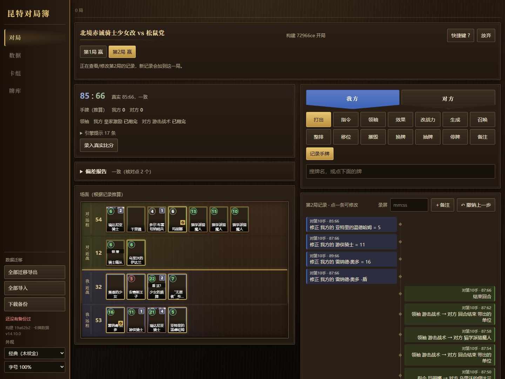

# 昆特对局簿 · Gwent Match Tracker

> **This is an unofficial fan work and is not approved/endorsed by CD PROJEKT RED.**
> 非官方爱好者作品，未经 CD PROJEKT RED 认可。

《巫师之昆特牌》（Gwent）对局记录与复盘工具。边打边记（或看录屏补记）每一步出牌，底层规则引擎逐步推算整局：每个单位的实时战力、护甲、状态、位置，各排小计和双方总分；再用真实比分校准，指出推算从哪一步开始偏差。

**在线使用：** https://szk256.github.io/Gwent_Helper/ （单个网页，对局数据只存在本机浏览器里，不上传；卡图从 gwent.one 加载）



## 特点

- **通用规则引擎**（`src/engine.js`）：不含具体卡牌，提供部署、增益、伤害、护甲、护盾、锁定、灌注、整排效果、计时、金币、潜伏、伏击、坚韧留场等积木和事件。
- **卡牌行为用积木组合**（`src/cards.js`）：全部非衍生牌已有行为；数值来自卡牌数据，月度平衡补丁按对局日期回退（旧对局按当时版本推算）。
- **记录快**：引擎能算的都自动算，用户只做选择（目标、随机结果、落地战力）；电脑上有快捷键。
- **偏差报告**：录入真实比分作为核对点，找到第一个不一致的位置，列出期间涉及的推测 / 需手动 / 未建模的牌，并能把未确认的规则逐个反过来对比。
- **导入导出**：纯 ASCII 的对局 / 卡组 / 牌库代码，整库迁移。
- `hud/`：对局 HUD 原型（Python），截屏识别对方已出的牌，可导出对局簿能导入的记录。只用屏幕上公开显示的画面（复盘时另读游戏写在本机的日志文件对时间，真人对局的日志里没有牌名），不改游戏、不读内存、不抓包、不操作游戏（不模拟点击、不自动出牌）。

界面目前只有中文；用户卡组以北方王国为主，其他阵营的牌也都已建模，但校准对局较少。

## 开发

```bash
npm ci
node build.js      # src/ 打包成 dist/gwent_tracker.html
npm test           # 引擎、卡牌、界面（jsdom）、回放
npm run smoke      # 每张已建模的牌都打一遍
```

`src/index.html` 可直接在浏览器打开调试。结构、规则约定和校准记录见 [CLAUDE.md](CLAUDE.md)。

## 声明

非官方、非商业的爱好者项目，与 CD PROJEKT RED 无关，按 [CD PROJEKT RED 爱好者内容准则](https://www.cdprojektred.com/en/fan-content) 发布；不接受付费、不设付费内容。Gwent、The Witcher 及相关名称、卡牌文字为 CD PROJEKT S.A. 所有。卡牌数据和卡图来自 [gwent.one](https://gwent.one)，卡图不包含在本仓库中。

代码以 [MIT](LICENSE) 许可发布（不含上述游戏内容）。
